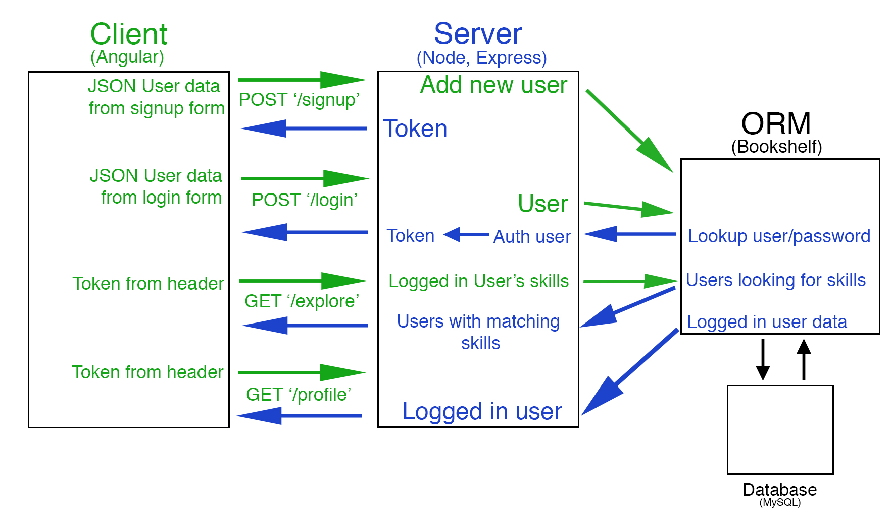
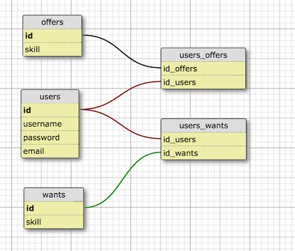

# Skillit

Skillit is a skill-sharing platform that facilitates matchmaking between passionate learners and teachers. Come out of your shell and share your yolk with the world!

## Team

  - __Product Owner__: Michael Arnold
  - __Scrum Master__: Justin Thareja
  - __Development Team Members__: Sarah Yu, Austin Worachet

## Table of Contents

1. [Requirements](#requirements)
1. [Development](#development)
    1. [Getting Started](#getting-started)
    1. [Client/Server Architecture](#client-server-architecture)
    1. [Database Architecture](#database-architecture)
1. [Roadmap](#roadmap)
1. [Contributing](#contributing)


## Requirements

- Node 0.10.x
- MYSQL 5.x
- npm 2.10.x
- bower 1.4.x

## Development
### Getting Started
<b>Step 1:</b> Fork the repo to your own github profile

<b>Step 2:</b> Clone your fork to a local directory on your computer
```
$ git clone https://github.com/YOUR_USERNAME/AdorableClowder.git
```

<b>Step 3:</b> Open a new terminal window and navigate to your clone of AdorableClowder

<b>Step 4:</b> Install Dependencies
```
$ npm install
```

<b>Step 5:</b> Open a new terminal window to start mySQL and log in
```
$ mysql.server start
$ mysql -u root
```

<b>Step 6:</b> Create a local database called 'clowderdb' from within mySQL
```
mysql> CREATE DATABASE clowderdb;
```

<b>Step 7:</b> Start the server with grunt
```
$ grunt
```

<b>Step 8:</b> Navigate to localhost:1337 in your browser and start hacking!

### Client/Server Architecture

### Database Architecture


<ul>
  <li><b>offers</b> contains all skills that users are willing to teach others.</li>
  <li><b>wants</b> contains all skills that users want to learn from others.</li>
  <li><b>users_offers</b> is a join table that contains each unique relationship between a user and a skill they have to offer </li>
  <li><b>users_wants</b> is a join table that cointains each unique relationship between a user and a skill they wish to learn</li>
</ul>

To query the DB manually, make sure mySQL is set to use the clowderdb database created previously. Once logged into mySQL:
```
mysql> \u clowderdb
```

<!-- db schema -->
<!-- a /u clowderdb sql command to access directly -->

### Roadmap

View the project roadmap [here](https://github.com/AdorableClowder/AdorableClowder/issues)


## Contributing

see [docs/CONTRIBUTING.md](https://github.com/AdorableClowder/AdorableClowder/blob/master/docs/_CONTRIBUTING.md) for contribution guidelines.
